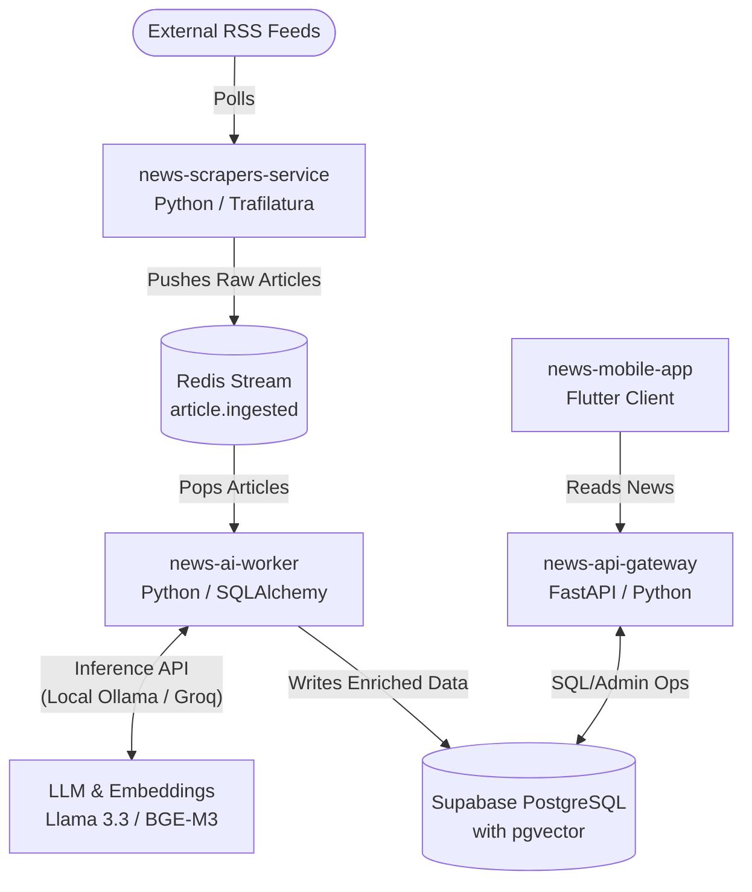

+++
date = '2026-06-07T11:00:00+05:30'
title = 'Building TheBulletin AI: An Autonomous, Bias-Aware News Aggregator'
description = 'An in-depth look at how we built an autonomous news ecosystem that scrapes, clusters, summarizes, and evaluates news bias and truthfulness using Llama 3.3 and pgvector.'
tags = ['AI', 'LLMs', 'Vector Search', 'System Architecture', 'NLP']
categories = ['Projects']
series = ['AI Projects']
+++

In the modern digital landscape, staying informed is harder than ever. It’s not because of a lack of information, but an abundance of it—specifically, the polarization, sensationalism, and sheer volume of duplicate reporting. Traditional aggregators simply fetch headlines and list them side-by-side. 

To solve this, I built **TheBulletin AI** (historically codenamed *Veritas Aggregator*): a fully autonomous, bias-aware news aggregator. Instead of just organizing links, it acts as a automated editorial room that ingests articles, semantically clusters them into single events, writes objective summaries, and evaluates the political bias and credibility of the coverage.

In this post, we’ll dive deep into the architecture of TheBulletin AI, with a core focus on **how AI powers the intelligence of the system**.

---

## The System Architecture: From RSS to Screen

The system follows a decoupled, contract-first, producer-consumer pattern designed to keep operational costs low while remaining highly scalable:



1. **`news-scrapers-service`**: Polls major Indian news RSS feeds, extracts the raw main text using `trafilatura` (stripping ads and HTML noise), and pushes a schema-validated article payload to a Redis stream.
2. **`news-ai-worker`**: Consumes raw articles from Redis, coordinates with LLMs for semantic clustering and metadata enrichment, and saves them to PostgreSQL.
3. **`news-api-gateway`**: A lightweight, highly concurrent FastAPI gateway that serves static endpoints cached at the Cloudflare CDN edge.
4. **`news-mobile-app`**: A cross-platform Flutter application providing users with a clean, instant-booting offline-first interface.

---

## How AI Powers the Brain

The heart of TheBulletin AI lies in the `news-ai-worker`. This service operates as an inference-agnostic pipeline that coordinates vector search models and Large Language Models to enrich raw incoming data.

Here are the two core AI pillars that drive the platform:

### 1. Semantic Clustering (Using BGE-M3 Embeddings + pgvector)
When a new article is scraped, the first challenge is deduplication and grouping. If ten different outlets write about the same press release, we shouldn't show the user ten separate headlines. 

Traditional keyword-based clustering breaks down when outlets use drastically different headlines:
* *Outlet A:* "Govt slashes corporate tax rates to boost investment."
* *Outlet B:* "New tax reforms draw criticism from opposition leaders."

To group these together, TheBulletin AI uses **semantic clustering**:
1. When an article is processed, we generate an embedding text string combining its title and a brief summary.
2. We call a vector embedding model (**BGE-M3** in local dev) to represent this text as a 768-dimensional vector.
3. We run a cosine similarity query in PostgreSQL using the `pgvector` extension against recent events:
   ```sql
   SELECT event_id, 1 - (embedding <=> :query_embedding) AS similarity
   FROM vector_embeddings
   ORDER BY similarity DESC
   LIMIT 1;
   ```
4. If the similarity is above our threshold (typically `0.85`), the worker automatically attaches the article to the existing `NewsEvent` cluster.
5. If no match is found, it creates a brand-new event cluster and saves the new vector embedding to the database.

This guarantees that different angles of the same story are automatically unified under a single narrative timeline.

---

### 2. Multi-Dimensional LLM Enrichment
Once we have a news event, we need to extract intelligence from it. Instead of running multiple expensive API calls, we prompt an instruction-tuned LLM (like **Llama 3.3 70B** or **Phi-3-mini**) to perform three analysis tasks in a single pass using **structured JSON mode**.

The system system prompt enforces a strict contract:

```json
{
  "summary": "2-3 sentence objective summary text",
  "bias": {
    "leaning": "left|center|right|mixed|unknown",
    "confidence": 0.0-1.0,
    "notes": ["evidence of slant or loaded language"]
  },
  "truth": {
    "score": 0.0-1.0,
    "corroboration_count": 0,
    "discrepancy_flags": ["list of factual contradictions"],
    "primary_wire_service": "reuters|afp|pti|null"
  }
}
```

Let's break down these three aspects of the enrichment bundle:

#### A. Objective Summarization
The LLM extracts factual core points from the raw text (truncated to 2,000 characters for latency and speed) to synthesize a neutral, jargon-free summary. By instructing the model to focus purely on the common denominator facts, we prevent the summary from carrying over the emotional slants of the individual outlets.

#### B. Bias Analysis
Polarized journalism often uses loaded adjectives, selective reporting, or opinionated framing. The model reviews the phrasing, compares it to neutral standards, and labels the political leaning as `left`, `center`, `right`, or `mixed` along with a confidence rating and brief supporting notes. 

For instance, if an article uses loaded emotional phrases to describe a legislative bill, the AI notes that phrasing, lowering the credibility or designating the leaning accordingly.

#### C. Truth-Verification Scoring
Trust is paramount. The LLM estimates a factual credibility score between `0.0` and `1.0`. It calculates this based on:
* **Corroboration**: Are other outlets reporting the same facts?
* **Discrepancy Flags**: Are there direct contradictions (e.g., conflicting casualty counts, dates, or statements)?
* **Source Quality**: Is the article citing reputable primary wire services like PTI, Reuters, or Associated Press?

---

## Balancing Local GPU Power & Cloud Economy

Deploying deep learning models can get incredibly expensive. TheBulletin AI is engineered with a **0-Investment Strategy** in local development, transitioning to a highly cost-optimized setup for production:

* **Local Dev (Zero-Cost):** We run a local Ubuntu server equipped with an NVIDIA RTX 5090. The backend wires directly to a local **Ollama** instance running `phi3:mini` (for chat completions) and `bge-m3` (for embeddings). This allows unlimited, fast, and free testing.
* **Production MVP:** Instead of keeping an expensive GPU server powered on 24/7 in the cloud, the worker switches to serverless inference endpoints like **Groq** or **Together AI** using the exact same OpenAI-compatible API client. We only pay a fraction of a cent per million tokens, scaling down to absolute zero when there are no new articles.

---

## Safe-guarding AI Outputs: Human-in-the-Loop

AI is not perfect. It can hallucinate, misinterpret satire, or make mistakes in bias analysis. To ensure the integrity of the platform, the architecture enforces two safety layers:

### 1. Global Traceability (Correlation IDs)
Every raw article is assigned a UUID v4 `trace_id` the moment it enters the scraper service. This `trace_id` is propagated through the Redis stream envelope, sent with LLM API headers, and persisted in the database. If an editor flags an incorrect summary, we can grep the JSON logs using that single `trace_id` to trace the entire pipeline's state and find exactly where the prompt fell short.

### 2. Database-Level Coalesced Overrides
We don't want to blindly trust the AI, nor do we want to overwrite its audit trail. The database schema supports `admin_truth_score_override` and `admin_bias_override` fields. 

When the API Gateway queries a news event to serve to the Flutter mobile app, it uses a SQL coalesce strategy:
```sql
SELECT 
    event_id,
    COALESCE(admin_truth_score_override, ai_truth_score) AS truth_score,
    COALESCE(admin_bias_override, ai_bias_leaning) AS bias_leaning
FROM news_events;
```
If an administrator manually overrides a score in the Retool-based Admin portal, the app instantly displays the verified human score, while the original AI-generated evaluation is preserved untouched for audit and prompt tuning.

---

## The Road Ahead

By leveraging vector embeddings for clustering and LLMs for bias/truth scoring, TheBulletin AI shifts the news reader's role from sifting through noise to analyzing objective narratives. 

Next on the roadmap is expanding the semantic search window to group historical events into macro-narratives (e.g., linking separate policy reform articles over a six-month period) to show how coverage changes over time.

*What are your thoughts on using AI to evaluate news bias? Let's discuss in the comments below!*
